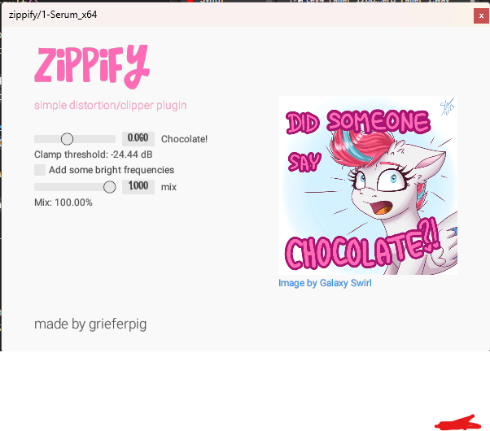

# Zippify VST Plugin: lil' simple distortion/clipper VST2 Effect

Part of a suite "Magic 5 VST FX Plugins"

Processing chain:
1. Remove silences
2. Clamp waveform (clipping)
3. Decrease precision
4. Gain
5. Mix

Notes:

It is suggested to use this plugin with a filter because this plugin will bring
unwanted extra frequencies.
